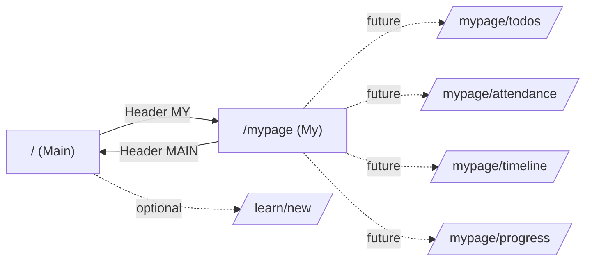

# Routing Overview (2026-01-28)

아주 쉬운 말: 문(주소)을 누르면 어느 방(page)으로 가는지 지도예요.

## Top-level
- `/` (Main)
  - 목적: 학습 생성 우선(히어로 + 생성 모달) + 최근 학습 간단 목록
- `/mypage` (My)
  - 목적: 내가 만든 학습을 관리(삭제/참여 토글/진척도 조절)

## Header Navigation Rule
- 현재 경로가 `/`이면 버튼 라벨은 `MY` → 링크는 `/mypage`
- 현재 경로가 `/mypage`면 라벨은 `MAIN` → 링크는 `/`
- 구현: `components/HeaderNavSwitch.tsx`

## 현재/향후 경로 계획
- 현재
  - `/` → app/page.tsx
  - `/mypage` → app/mypage/page.tsx
- 자리잡기(향후)
  - `/mypage/todos`, `/mypage/attendance`, `/mypage/timeline`, `/mypage/progress`
- 제안(선택)
  - `/learn/new` 페이지 라우트(모달과 병행) → 공유/딥링크/a11y 향상

## 5살 설명
- 집 문은 두 개예요. 큰 거실(메인)과 내 방(마이). 위에 있는 버튼으로 쓱쓱 바꿔 가요.

## Mermaid: 라우팅 개요


## 코드 스니펫: HeaderNavSwitch 사용
```tsx
// app/layout.tsx
import { HeaderNavSwitch } from "@/components/HeaderNavSwitch";

<header>
  <div className="container h-14 flex items-center justify-between">
    <Link href="/">Second Semester</Link>
    <nav>
      <HeaderNavSwitch />
    </nav>
  </div>
  {/* HeaderNavSwitch는 경로에 따라 MY↔MAIN을 자동 전환 */}
</header>
```
