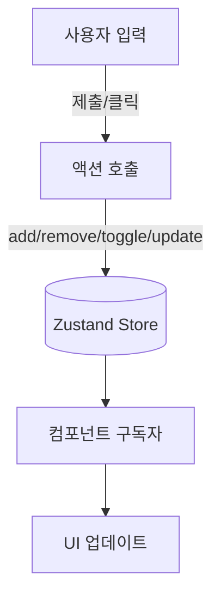

# State Flow (2026-01-28)

아주 쉬운 말: 기억 상자(상태)가 어떻게 바뀌고, 화면이 어떻게 따라 바뀌는지 그림이에요.

## Learnings Store
- 파일: `lib/store/learnings.ts`
- 상태(Shape)
  - `learnings`: { id, title, createdAt, progress, joined }[]
- 액션(Actions)
  - `addLearning(title)` → 새 항목을 맨 앞에 추가
  - `removeLearning(id)` → 해당 항목 삭제
  - `toggleJoined(id)` → 참여 여부 토글
  - `updateProgress(id, progress)` → 0~100로 클램프 후 업데이트

## Timeline Store (요약)
- 파일: `lib/store/timeline.ts`
- 상태: `items`: TimelineItem[]
- 유틸: `dateToKey(date)`
- 셀렉터: `getByDate(date)`

## 화면 반영(Subscribe)
- Main(`/`): `useLearningStore`로 `learnings`/`addLearning` 구독 → 모달 생성/최근 목록 반영
- My(`/mypage`): `useLearningStore`로 목록/액션 구독 → 삭제/토글/진척도 조작

## 데이터 흐름(단방향)
사용자 액션 → 액션 호출 → 상태 변경 → 구독 중 컴포넌트 리렌더 → UI 갱신

## 5살 설명
- 상자에 그림(학습 카드)을 넣고 빼요. 새 그림을 넣으면 앞에 뿅! 하고 생겨요. 버튼을 누르면 참여/진척도를 바꿀 수 있어요.

## Mermaid: 상태/액션 흐름


## 코드 스니펫: learnings store
```ts
// lib/store/learnings.ts
export const useLearningStore = create<LearningState>((set) => ({
  learnings: [],
  addLearning: (title) => {
    const id = `l_${Math.random().toString(36).slice(2, 8)}`;
    const createdAt = new Date().toISOString();
    set((s) => ({ learnings: [{ id, title, createdAt, progress: 0, joined: true }, ...s.learnings] }));
    return id;
  },
  // ...removeLearning/toggleJoined/updateProgress
}));
```
